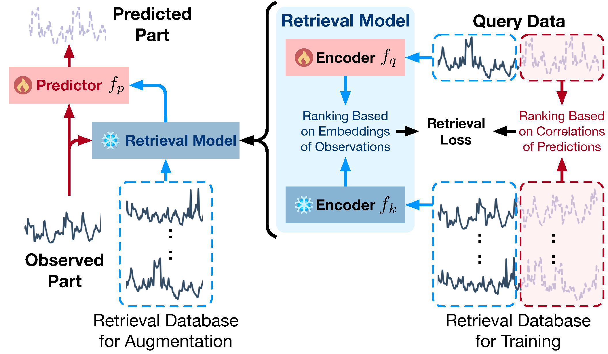

# CaRTS

Code for the paper **Learning a Causation-driven Retrieval Model for Effective Time Series Augmentation and Forecasting**.

CaRTS is a two-stage framework for time series forecasting. The `Retrieval` module learns a causation-driven retrieval model, and the `Prediction` module uses retrieved information to improve forecasting performance.

The overview pipeline is shown below.



## Structure

```text
CaRTS/
├── Retrieval/      # retrieval model training
├── Prediction/     # forecasting model training
├── pic/            # paper figures
└── environment.yaml
```

## Setup

Create the environment with:

```bash
conda env create -f environment.yaml
conda activate CaRTS_env
```

## Data Preparation

Before running the code, create a `dataset` folder under both `Retrieval` and `Prediction`, then place the required datasets in these directories.

```bash
mkdir -p Retrieval/dataset
mkdir -p Prediction/dataset
```

## Training Pipeline

Run the project in the following order:

1. Run the corresponding scripts under `Retrieval/scripts/pretrain`.
2. Run the corresponding scripts under `Retrieval/scripts/train`.
3. Run the corresponding scripts under `Prediction/scripts/train`.

In short:

```text
Retrieval pretrain -> Retrieval train -> Prediction train
```

## Example

```bash
mkdir -p Retrieval/dataset Prediction/dataset

# download and place the required dataset files first

bash Retrieval/scripts/pretrain/<dataset>_pretrain.sh
bash Retrieval/scripts/train/<dataset>.sh
bash Prediction/scripts/train/<dataset>.sh
```
